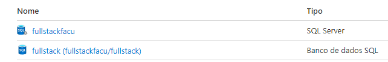
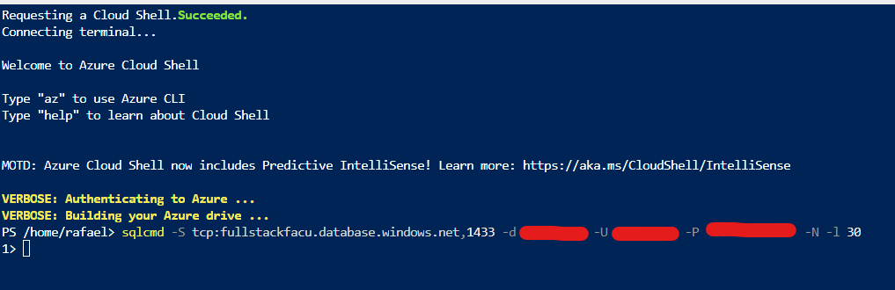
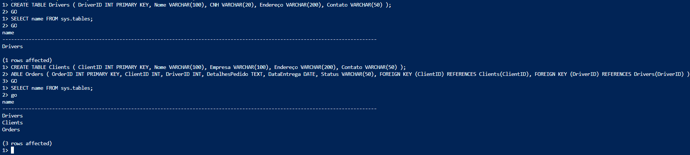
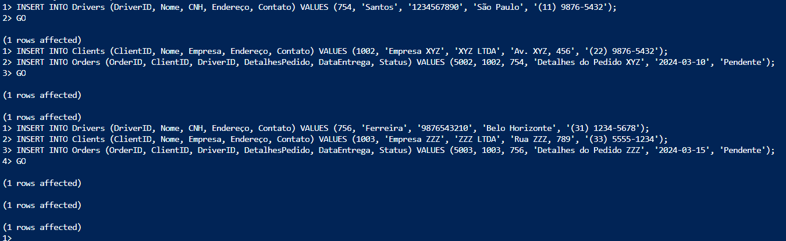
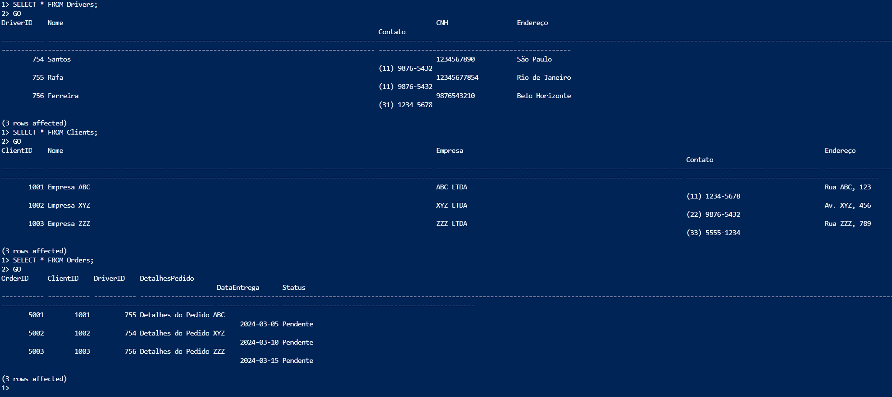
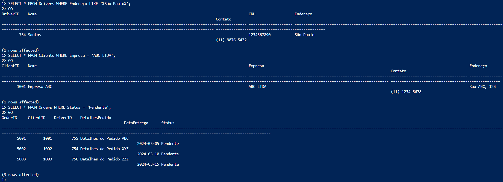
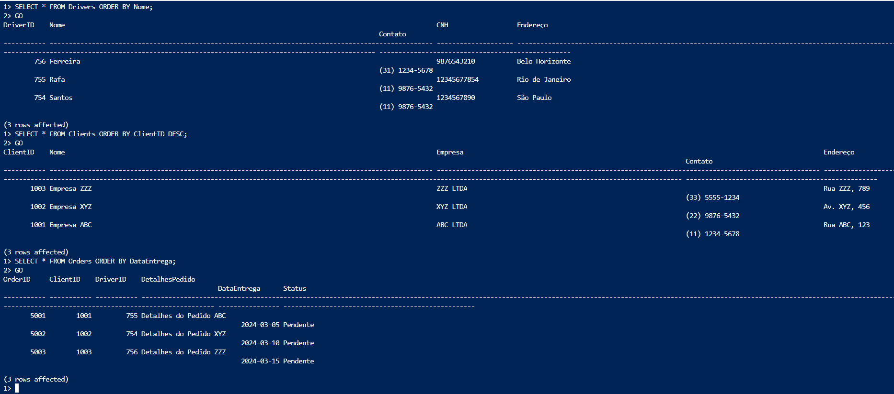
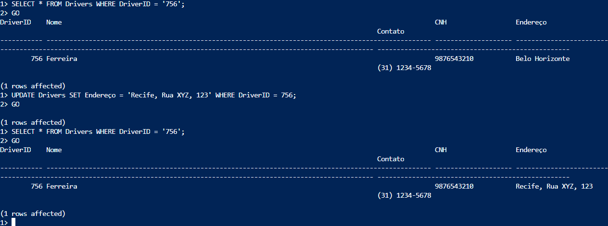
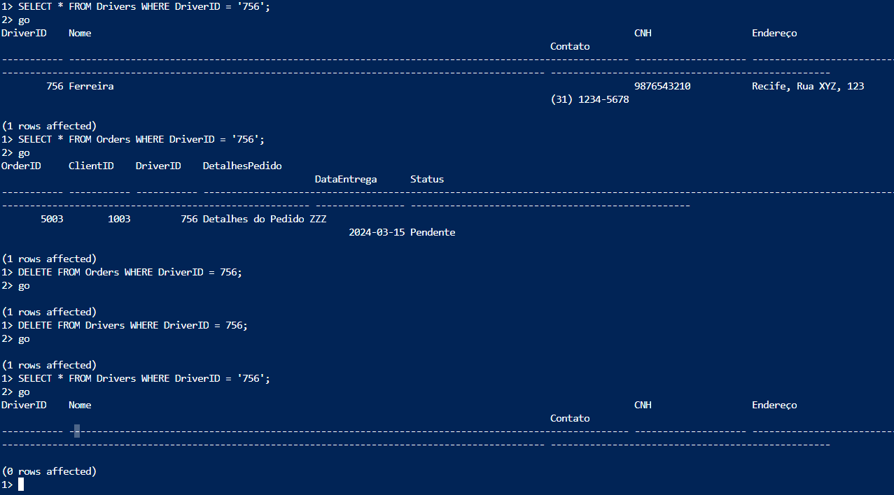

# Projeto Banco de Dados SQL no Azure

## Criação do Banco de Dados SQL no Azure

Para começar, siga os passos abaixo para criar o banco de dados SQL no Azure:

1. Faça login no [Portal do Azure](https://portal.azure.com/).
2. No painel de navegação à esquerda, selecione "Criar um recurso".
3. Na barra de pesquisa, digite "SQL Database" e pressione Enter.
4. Selecione "Banco de Dados SQL do Azure" nos resultados da pesquisa.
5. Clique em "Criar" na página do Banco de Dados SQL do Azure.
6. Preencha as informações necessárias, como nome do banco de dados, grupo de recursos, localização, nível de serviço, etc.
7. Clique em "Revisar + Criar" e, em seguida, em "Criar" para criar o banco de dados.
8. Aguarde até que o processo de criação seja concluído.

## Configuração do Firewall e Segurança

Certifique-se de configurar corretamente as opções de segurança, firewall e acesso ao banco de dados para garantir a integridade e a segurança dos seus dados.

Nesse caso de uso nós vamos : 

1. No portal do Azure, navegue até o seu banco de dados SQL recém-criado.
2. Na página de visão geral do banco de dados, selecione "Rede:Mostrar configurações de rede".
3. Permita que determinados endereços IP da Internet pública acessem seu recurso.
4. Clique em "Adicionar IP" para adicionar seu endereço IP atual à lista de permissões.
5. Se desejar, você também pode configurar regras de firewall adicionais para permitir acesso de outros endereços IP específicos ou intervalos de endereços.

## Conectar com o Banco

Execute o comando no PowerShell ou Bash dentro do Azure:

az sql db show-connection-string --client sqlcmd --name `<nome do banco>`

Resposta é algo como : 

`sqlcmd -S tcp:fullsstackfacu_teste.database.windows.net,1455 -d fullstack -U <username> -P <password> -N -l 30`

Vamos conectar com o banco executando o comando acima :

Certifique-se de substituir `<nome do banco>`, `<username>` e `<password>` pelos valores reais do seu banco de dados.

## Criação e Estruturação das Tabelas:

Para criar as tabelas necessárias para o projeto, execute os códigos SQL encontrados no arquivo [`SQL.sql`](SQL.sql).

As tabelas criadas incluem:

- `Drivers`
- `Clients`
- `Orders`

Você pode visualizar a criação das tabelas na imagem abaixo:

## Inserção e Gestão de Dados

Para adicionar dados nas tabelas, execute os códigos T-SQL encontrados no arquivo [`SQL.sql`](SQL.sql).

Você pode visualizar a inserção de dados nas tabelas na imagem abaixo:

## Execução e Validação de Consultas:

### Vamos Executar Select primeiro : 

- `SELECT * FROM Drivers;`
- `SELECT * FROM Clients;`
- `SELECT * FROM Orders;`

Resultado : 

### Agora vamos Filtrar, Comandos : 

- Filtrar os motoristas por cidade de origem (por exemplo, São Paulo):`SELECT * FROM Drivers WHERE Endereço LIKE '%São Paulo%';`
- Filtrar os clientes por nome da empresa (por exemplo, Empresa ABC):`SELECT * FROM Clients WHERE Empresa = 'ABC LTDA';`
- Filtrar os pedidos por status (por exemplo, Pendente):`SELECT * FROM Orders WHERE Status = 'Pendente';`

Resultado :  

### Vamos ordernar, comandos : 

- Ordenar os motoristas por nome em ordem alfabética:`SELECT * FROM Drivers ORDER BY Nome;`
- Ordenar os clientes por ID do cliente em ordem decrescente: `SELECT * FROM Clients ORDER BY ClientID DESC;`
- Ordenar os pedidos por data de entrega em ordem crescente: `SELECT * FROM Orders ORDER BY DataEntrega;`
  
Resultado : 

## Update e Delete no dados 

### Update, Comandos : 

 Atualizar o endereço do motorista com ID 756 : 
- `UPDATE Drivers SET Endereço = 'Recife, Rua XYZ, 123' WHERE DriverID = 756`
  
Resultado : 

### Delete, Comandos : 

 Deletar o motorista com ID 756 :
- `DELETE FROM Orders WHERE DriverID = 756;`
- `DELETE FROM Drivers WHERE DriverID = 756;`

Resultado : 

## Sobre o Projeto

O projeto consiste em desenvolver um sistema de gestão de entregas para uma empresa de logística. O principal objetivo do sistema é automatizar e otimizar o processo de entrega de mercadorias, desde o recebimento do pedido até a sua entrega final ao cliente. O sistema permitirá o cadastro e gerenciamento de motoristas, clientes e pedidos, além de fornecer funcionalidades para rastreamento de pedidos em tempo real e geração de relatórios de desempenho logístico. Ao centralizar e organizar as informações relacionadas às entregas, o sistema visa melhorar a eficiência operacional da empresa, reduzir custos e proporcionar uma experiência de entrega mais satisfatória aos clientes.

## Autor

[GitHub: 'Rafa1a', CodiNome: 'Frango Dev', Nome : 'Rafael Altero']

